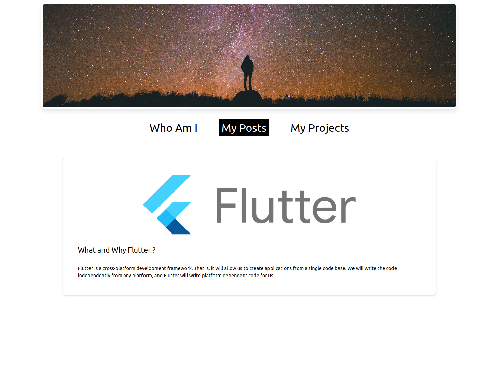

# Portfolio

This repo contains source code for my portfolio website. It uses SvelteKit to render the website along with TypeScript and Tailwindcss. It's  statically (currently) built and deployed to my personal server to be server by NGINX. 

This portfolio page is accessible on [ogreten.xyz](https://ogreten.xyz).

Basically, It consists of **Who Am I**, **My Posts**, and **My Projects** pages. Who Am I page is a simple page that contains a short bio about me. My Posts page is a page that contains my latest posts on Medium. To retrieve Medium posts, it uses RSS. Lastly, My Projects page contains a list of all my projects available on GitHub. It uses GitHub API for retrieving those projects.

## Future Improvements

For now, I'm still working on this portfolio page. I'm planning to add more features to it. I will update this list as I add and implement more features.

- [ ] CI/CD for the website
- [ ] Add Who Am I page